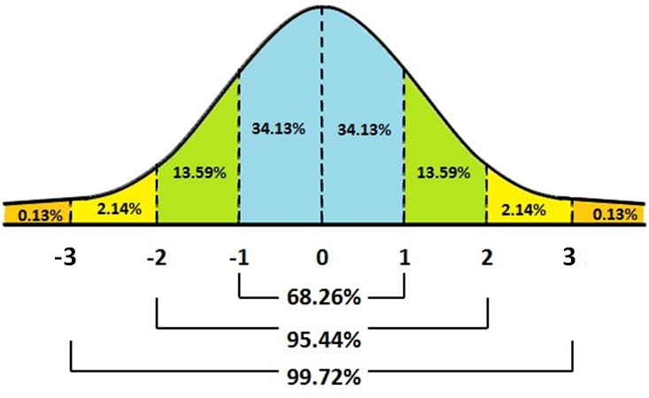
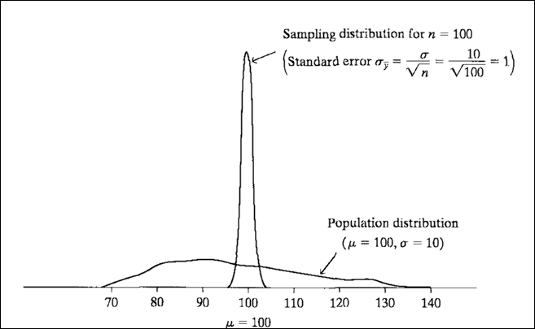

## Amostragem e inferência
Em um dos [relatórios de pesquisa](http://media.folha.uol.com.br/datafolha/2018/10/26/3416374d208f7def05d1476d05ede73e.pdf) do Datafolha para as eleições do ano passado, lemos a seguinte frase:

<center>

</center>

Para entender o que quer dizer isso (e por que essa descrição está errada), precisamos falar de amostras, estimação e incerteza.

# Amostras

## Como selecionar a amostra?
Toda inferência depende dos dados coletados e de um conjunto de suposições. Uma das suposições mais importantes é a de que a **amostra é aleatória**, ou seja, todos os indivíduos têm a mesma probabilidade de ser selecionado.

Parece uma coisa simples, mas conseguir uma amostra aleatória de verdade é mais difícil do que aparenta. Na prática, é raríssimo fazer uma amostra aleatória simples, e algumas técnicas são adotadas para selecionar amostras *como se fossem* aleatórias. Não vamos entrar em detalhes aqui, mas podemos destacar duas famílias de técnicas bastante utilizadas.

## Amostras na prática

- Pré-estratificação: as observações são selecionadas de modo a cumprir proporções equivalentes àquelas encontradas na população

- Pós-estratificação: As observações são ponderadas de modo a aumentar a influência de estratos subrepresentados na amostra e diminuir a influência de estratos sobrerepresentados

Qual é a desvantagem dessas técnicas?

## Tamanho da amostra não depende da população!
Note que as fórmulas para definir o tamanho da amostra são

$$n = \sigma^{2} \left(\frac{z}{M} \right)^{2}$$

$$n = \pi(1 - \pi) \left(\frac{z}{M} \right)^{2}$$

O tamanho da população não influencia o tamanho da amostra. O que a define são o nível de confiança, a estimativa intervalar e a dispersão da variável 

# Estimação e Inferência

## Uma Senhora Toma Chá...
Uma senhora inglesa, grande apreciadora de chá com leite (sim, eu sei), dizia ser capaz de identificar se o chá foi colocado antes ou depois do leite na mistura. Segundo ela, a mistura só ficava boa se o leite era posto antes do chá. Mas será que ela sabe mesmo identificar?

- Se a gente der apenas uma xícara para testar o conhecimento dela, ela pode acertar por sorte (50% de chance)
- Se dermos mais xícaras, como identificar se a proporção de acertos dela é indestinguível da sorte?

Fisher preparou 8 xícaras, alternando entre chá antes do leite e leite antes do chá. Ela deveria pegar 4 dessas xícaras e dizer o que foi posto antes.

## Uma Senhora Toma Chá...
Assumindo que ela estivesse chutando:

- A chance de acertar os 4 resultados é de 1,4% (1/70)

- A chance de acertar 3 resultados é 22,8% (16/70)

<center>

</center>


## Inferência
A motivação mais comum para o uso de estatística nas ciências sociais é fazer inferências com base em amostras. A ideia é que, para saber uma característica qualquer da população, podemos observar alguns casos e seguir algumas regras de estimação.

A diferença mais importante entre a estatística inferencial e a estatística descritiva é que, na primeira, precisamos **calcular e comunicar a incerteza**. Não fazemos inferência estatística para *descobrir* qual é o valor de um parâmetro; fazemos inferência para dar um palpite razoável sobre esse valor, com cálculo preciso da incerteza.

Vamos ver alguns conceitos básicos.

## Probabilidade = área sob a curva
Para efeitos dessa aula, consideraremos probabilidade com a área sob uma distribuição, como no exemplo abaixo:

<center>

</center>

## Probabilidades na curva normal (regra empírica)
- Distribuição normal é simétrica
- Pode ser inteiramente descrita com dois parâmetros: média e desvio-padrão
- Comum na natureza, também é bastante usada nas ciências sociais devido ao Teorema Central do Limite

<center>

</center>

## Distribuição de amostras
- Em ciências sociais, quase nunca as distribuições são normais
- Muitas vezes, não sabemos como se comporta a distribuição real
- Podemos usar amostras para fazer inferências sobre os parâmetros da distribuição
- As estatísticas dessas amostras, quando obtidas repetidamente, seguem uma distribuição repetida
- Não estamos mais falando de distribuição de valores de uma variável, mas de estatísticas que emergem de diversas
amostras
- Exemplo: como se comporta a distribuição da intenção de votos em uma eleição?

## Exemplo
<center>

</center>

## Distribuição de amostras
- Se fizermos diversas amostras de uma mesma população, podemos esperar variabilidade nos resultados
- Esse erro ´ e inerente ao fato de que estamos utilizando apenas uma parte da população: a amostra
- Por isso institutos de pesquisas têm números diferentes para uma eleição. Mas essa variação segue um padrão conhecido
- Na prática, não precisamos tirar diversas amostras: podemos calcular o **erro padrão**


<center>
<span class="red">
Erro padrão é o erro que esperamos obter se fizermos diversas amostras de uma mesma população
</span>
</center>

## Erro padrão
<center>
{width=800px}
</center>

## Maior amostra - menor erro
<center>
{width=800px}
</center>

## Teoremas fundamentais
Você pode ser perguntar: se estamos fazendo apenas uma pesquisa, como sabemos que o valor dela representa um palpite razoável sobre o parâmetro?

- [Lei dos Grandes Números](https://seeing-theory.brown.edu/basic-probability/index.html#section2): A média amostral converge para o valor esperado da distribuição à medida em que o n cresce. Exemplo: jogar dados repetidas vezes
- [Teorema Central do Limite](https://seeing-theory.brown.edu/probability-distributions/index.html#section3): A distribuição amostral da média se aproxima de uma normal, independentemente da distribuição original da variável

## Simulação - Lei dos Grandes Números
```{r echo=FALSE, fig.align="center", fig.height=5, message=FALSE, warning=FALSE}
if (!require(ggplot2)) install.packages("ggplot2")
if (!require(gganimate)) install.packages("gganimate")
if (!require(dplyr)) install.packages("dplyr")

# Para replicar a simuação
set.seed(1234)

n <- 500 # número de jogadas
p_cara <- .5 # probabilidade teórica  de sair cara

# Simulação das jogadas 
simul <- sample(x = c(0,1),
               prob = c(1 - p_cara, p_cara), 
               size = n, 
               replace = TRUE)

r <- cumsum(simul) # soma acumulada
n = 1:n
v_esperado = r/n # probabilidade de cara em cada jogada

# Jogando a simulação em um banco de dados 
bd <- data.frame(jogada = 1:500, prop = v_esperado)

# Animação
p <- ggplot(bd, aes(x = jogada, y = prop, frame = jogada)) +
  geom_path(aes(cumulative = TRUE), size = 1) + xlim(1, 500) + ylim(0.0, 1.0) +
  geom_hline(yintercept = 0.5, color = "red", linetype = "dashed") +
  ggtitle("Proporção de caras quando jogamos uma moeda") +
  ylab(NULL) +
  xlab("Jogadas") +
  theme_classic() +
  transition_reveal(jogada)

p

```

## Teorema Central do Limite
<center>
{width=500px}
</center>

## Não confunda!
- Distribuição da população **vs** distribuição dos dados amostrais vs distribuição amostral
- Desvio-padrão **vs** erro padrão
- Número de amostras **vs** número de observações

## Estimação pontual e intervalar
Como fazer a ponte entre os dados que coletamos em nossa amostra e o valor verdadeiro do parâmetro populacional? Como comunicar a incerteza?

- **Estimativa pontual**: o melhor palpite que podemos dar sobre o valor do parâmetro
- **Estimativa intervalar**: um intervalo de valores dentro do qual acreditamos que o parâmetro se encontra

## Propriedades dos estimadores
<center>
{width=800px}
</center>

## Propriedades dos estimadores
<center>
{width=800px}
</center>

##  Comunicando incerteza
Lembre-se de que não estamos olhando para toda a população. Tão importante quanto identificar qual é o “melhor palpite” sobre
o valor do parâmetro é comunicar seu grau de incerteza em relação à estimativa.

- **Intervalo de confiança**: estimativa intervalar, calculada pelo pesquisador durante a análise
- **Nível de confiança**: <span class="red">definido</span> pelo pesquisador antes da análise dos dados
- **Margem de erro**: erro-padrão multiplicado pelo número de desvios-padrões que produzem o nível de confiança definido
previamente pelo pesquisador

<center>
**intervalo de confiança = estimativa pontual ± m. de erro**
</center>

## Intervalo de confiança
<center>
{width=800px}
</center>

## Trade-off entre nível de confiança e intervalo de confiança
<center>
{width=800px}

[Uma simulação ilustrativa](http://rpsychologist.com/d3/CI/)
</center>


# Teste de Hipóteses

## Teste de hipóteses
Teste de hipóteses é um conjunto de regras para a tomada de decisão. Alguns conceitos fundamentais:

- **Hipótese nula**: É a hipótese sendo testada. Tradicionalmente, uma afirmação cética que postula que “o efeito é nulo”, “não há alteração”, “não há associação” ou “não há diferença”

- **Hipótese alternativa**: O que podemos concluir se rejeitarmos a hipótese nula. Também chamada de **hipótese de pesquisa**

## Tipos de erro
- **Erro Tipo I**: Rejeitar hipótese nula quando ela é verdadeira

- **Erro Tipo II**:  Não rejeitar hipótese nula quando ela é falsa

<center>
{width=800px}
</center>

## Relembrando o intervalo de confiança
<center>
{width=800px}
</center>

# Revisão: Inferência e Estimação

## Amostragem e inferência
Retomando:

- O primeiro passo é deixar de pensar em distribuição dos dados e passar a pensar em **distribuiçao amostral**
    - Distribuição amostral é uma distribuição de *estatísticas*, em vez das distribuições de observações com as quais estamos habituados
- O [Teorema Central do Limite](https://seeing-theory.brown.edu/probability-distributions/index.html#section3) mostra **convergência em distribuição**: qualquer que seja a distribuição original das observações, suas médias convergem para a distribuição Normal
- A [Lei dos Grandes Números](https://seeing-theory.brown.edu/basic-probability/index.html#section2) mostra **convergência pontual**: com n grande o suficiente, as estimativas convergem para o valor verdadeiro na população

## Em inferência, é muito importante comunicar incerteza!
Inferência é um **palpite bem informado** sobre o valor do parâmetro, condicionado a algumas suposições. Não basta falar qual é o seu palpite, é fundamental comunicar com clareza quão certo você está dele!

- <span class="red">Estimativa pontual</span> é o melhor palpite que podemos dar sobre o valor do parâmetro. Sua representação mais comum é a **média**
- <span class="red">Estimativa intervalar</span> é um conjunto de valores que consideramos palpites razoáveis. Quanto mais largo o intervalo, maior nossa incerteza. Geralmente é representado pelo **intervalo de confiança** ou pela **margem de erro**
- <span class="red">Nível de confiança</span> é um valor definido *a priori*, que traduz qual é o grau de incerteza que estamos dispostos a aceitar em nosso palpite

## A leitura no nosso primeiro exemplo faz sentido?
Datafolha em 2014: 

<center>
{width=900px}
</center>

Datafolha em 2018: 

<center>
{width=900px}
</center>

## Uma revisão geral, cortesia do Nexo

## {data-background-video="nexo.mp4"}

# Aplicação

## Eleições 2016
O foco da aula de hoje é teórico, então apenas vamos ilustrar com um teste bem simples. Nas próximas aulas veremos como desenvolver os testes e criar análises gráficas a partir deles. Por agora, vamos ver como fazer inferência para uma pesquisa para a Prefeitura de São Paulo em 2016. Os dados foram baixados do [site do CIS](http://www.nadd.prp.usp.br/cis/DetalheBancoDados.aspx?cod=B570&lng=pt-br).

```{r message=FALSE, warning=FALSE, results='hide'}
if (!require(readr)) { install.packages("readr") } 
bd <- read_delim("BD_CIS0570.csv", ";")
View(bd)

# Número de respondentes
nrow(bd)

# No questionário podemos ver que a pergunta sobre a intenção de votos é a p2
table(bd$p2, useNA = "always")

# Vamos transformar os códigos 96 e 99 em NA
bd$p2[bd$p2 == 96 | bd$p2 == 99] <- NA
table(bd$p2, useNA = "always")
```

## Intenções de voto
```{r message=FALSE, warning=FALSE, results='hide'}
# Extrair número de votos na amostra
votos_doria <- length(which(bd$p2 == 6))
votos_haddad <- length(which(bd$p2 == 3))
votos_marta <- length(which(bd$p2 == 10))

# Estimativas para Dória, Haddad e Marta
prop.test(x = votos_doria, n = 1510)
prop.test(x = votos_haddad, n = 1510)
prop.test(x = votos_marta, n = 1510)
```

## Diferenças entre os candidatos

```{r message=FALSE, warning=FALSE}
# Intenções de votos de Haddad e Dória são estatisticamente diferentes?
prop.test(x = c(votos_doria, votos_haddad), 
          n = c(1510, 1510))

```


## Diferenças entre os candidatos

```{r message=FALSE, warning=FALSE}
# Intenções de votos de Haddad e Marta são estatisticamente diferentes?
prop.test(x = c(votos_marta, votos_haddad), 
          n = c(1510, 1510))


```


