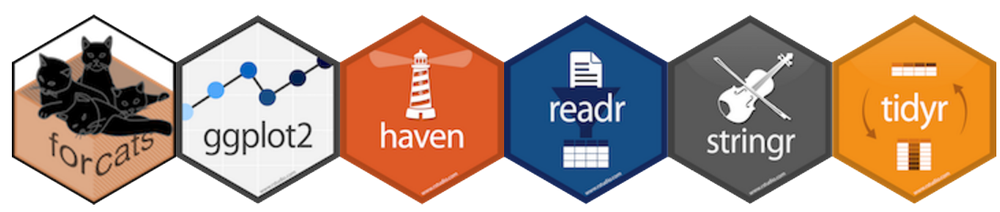

## 
<center>
> “Happy families are all alike; every unhappy family is unhappy in its own way.”
>
> --- Liev Tolstoi

> “Tidy datasets are all alike; every messy dataset is messy in its own way.”
>
> --- Hadley Wickham

</center>

## Tidy Data vs. Messy Data


- Em todos os exemplos com os quais trabalhamos até agora, a base de dados já estava no formato correto (nos casos em que não estavam, eu fiz as correções sem mostrar para vocês)
- No mundo real, a grande maioria dos dados não vai estar no formato certo. Hoje vamos aprender a transformar os dados para que eles fiquem *tidy*

## *Tidyverse*
Todas as  ferramentas que vamos ver fazem parte do [tidyverse](https://www.tidyverse.org/), um conjunto de pacotes para tratamento de bases de dados.

```{r message=FALSE, warning=FALSE}
# install.packages("tidyverse")
library(tidyverse)
```

Esse conjunto de pacotes segue o mesmo conjunto de princípios que já vimos com o `ggplot`: simplicidade, coerência entre as funções e clareza no tratamento dos dados. Esses princípios tem sido tão bem sucedidos que estão se espalhando para além do `tidyverse`, e se tornando o padrão de análise de dados no R.

<center>
{width=600px}
</center>

## 
<center>
{width=300px}
</center>

O *pipe* (`%>%`) deixa a ordem das operações mais clara, tornando o código mais fácil de ler e de compreender.

```{r eval=FALSE, echo=TRUE}
# Um vetor qualquer
x <- c(1:10)

# Um cálculo simples com código complicado
sum(sqrt(factorial(x)))

# O mesmo cálculo com %>% 
x %>% factorial() %>% sqrt() %>% sum()
```

## Verbos
Assim como no `ggplot` há uma sintaxe de visualização de dados, no `tidyverse` vamos tratar de **verbos** que descrevem passo-a-passo as tarefas de manipulação de dados:

1. Selecionar casos com `filter()`
2. Ordenar variáveis com `arrange()`
3. Manipular colunas com `select()` e `rename()`
4. Criar variáveis com `mutate()`
5. Recodificar variáveis com `case_when()`
6. Resumir informações com `summarise()` e `group_by()`
7. Reorganizar bases com `gather()` e `spread()`
8. Mesclar bases com `left_join()`
9. Juntando transformação e visualização
10. Aplicação


## Padrões de votação na Câmara dos Deputados 
vamos utilizar o pacote `congressbr` para analisar a votação que permite 100% de capital estrangeiro em companhias aéreas brasileiras ([PL 2724/2015](https://www.camara.leg.br/proposicoesWeb/fichadetramitacao?idProposicao=1672576)).

```{r message=FALSE, warning=FALSE, results='hide'}
library(congressbr)

# Quem apresentou essa PL?
cham_bill_info(type = "PL", number = "2724", year = "2015")$author_party

# Carregar os dados da votação nominal
pl2724 <- cham_votes(type = "PL", number = "2724", year = "2015")

# Note que essa votação ocupou diversas sessões (só no dia 20/03 foram 9 sessões)
View(pl2724)
```

**Abra o visualizador de dados em uma janela separada para acompanhar as alterações nos próximos slides!**

## Selecionar casos com `filter()`
Vamos nos concentrar na votação do dia 20/03, em que o texto do substitutivo foi aprovado. As votações posteriores trataram de destaques apresentados ao texto, e a grande maioria foi rejeitada.

O comando `filter()` **seleciona observações**, como o filtro do Excel. Vamos selecionar apenas a votação do substitutivo.

```{r message=FALSE, warning=FALSE, results='hide'}
pl2724 <- pl2724 %>% 
  filter(rollcall_subject == "SUBEMENDA SUBSTITUTIVA GLOBAL DE PLENARIO")
```

Podemos usar operadores lógicos para aplicar filtros com múltiplos critérios, assim como armazenar os resultados em um novo objeto

```{r eval=FALSE, echo=TRUE}
votos_AP <- pl2724 %>% 
  filter(rollcall_subject == "SUBEMENDA SUBSTITUTIVA GLOBAL DE PLENARIO" & legislator_state == "AP")
```

## Relembrando os operadores lógicos
<center>

</center>

## Ordenar variáveis com `arrange()`
O comando `arrange()` é simples: ele ordena o banco de dados com base na variável que você selecionar. Variáveis adicionais serão usadas como critério de desempate

```{r message=FALSE, warning=FALSE, results='hide'}
# Parlamentares ordenados por posicionamento e por nome
pl2724 <- pl2724 %>% 
  arrange(legislator_vote, legislator_name)

# Ordenamento descendente
pl2724 <- pl2724 %>% 
  arrange(desc(legislator_party))
```


## Manipular colunas com `select()`
Em uma bases de dados com um número muito grande de colunas, você pode querer selecionar apenas aquelas que são mais importantes

```{r message=FALSE, warning=FALSE, results='hide'}
# Selecionar apenas os nomes e votos dos  deputados
nomes_e_votos <- pl2724 %>% 
  select(legislator_name, legislator_vote)

# Selecionar todas as colunas menos a data e o horário
sem_sumario <- pl2724 %>% 
  select(-(3:4))
```

## Manipular colunas com `select()`

```{r message=FALSE, warning=FALSE, results='hide'}
# Algumas funções mais específicas
comeca_com <- pl2724 %>% 
  select(starts_with("legislator_"))

ori_lideres <- pl2724 %>% 
  select(ends_with("_orientation"))

leis <- pl2724 %>% 
  select(contains("bill"))

# Alterar a ordem de apresentação das variáveis
pl2724 <- pl2724 %>% 
  select(legislator_name, legislator_state, legislator_party, legislator_vote, everything())

```

## Renomear variáveis com `rename()`
A função `rename()` é prima da `select()`. Com ela, conseguimos trocar o nome de uma variável (`select()` também faz isso, mas apaga todas as outras variáveis do banco)

```{r message=FALSE, warning=FALSE, results='hide'}
# IMPORTANTE: o nome novo da variável vem primeiro
pl2724 <- pl2724 %>% 
  rename(assunto = rollcall_subject)
```

## Criar variáveis com `mutate()`

Esse é um dos comandos mais úteis de todo pacote. Frequentemente, as bases de dados não têm todas as informações que queremos, mas podemos criar nossas próprias variáveis

```{r message=FALSE, warning=FALSE, results='hide'}
# Note que as variáveis type_bill, number_bill e year_bill continuam no banco de dados
pl2724 <- pl2724 %>% 
  mutate(info_pl = paste0(type_bill, " ", number_bill, "/", year_bill))

# O comando transmute faz a mesma coisa, mas só mantém a variável nova
apenas_nova <- pl2724 %>% 
  transmute(info_pl = paste0(type_bill, " ", number_bill, "/", year_bill))
```

## Recodificar variáveis com `case_when()`
Uma das funções mais úteis para ser usada com o `mutate()` é o `case_when()`. Com ele, podemos recodificar nossas variáveis para criar faixas de idade, salário, etc.

```{r message=FALSE, warning=FALSE, results='hide'}
# Criar variável dummy para saber se o legislador colaborou com o governo
pl2724 <- pl2724 %>% 
  mutate(colab_governo = case_when(legislator_vote == GOV_orientation ~ "Sim",
                                   TRUE ~ "Nao"))

# Quando deputados não comparecem a uma sessão, o pacote congressbr trata esse dado como NA (Not Available). Vamos transformar esse missing em uma informação. IMPORTANTE: quando fazemos um mutate com uma variável que já existe no banco, perdemos a variável original!
pl2724 <- pl2724 %>% 
  mutate(legislator_vote = case_when(is.na(legislator_vote) ~ "Nao Compareceu",
                                     TRUE ~ legislator_vote))


```

## Resumir informações com `summarise()`
O comando `summarise()` resume os dados. Podemos querer saber, por exemplo, [quantos votos foram a favor da matéria](https://www2.camara.leg.br/atividade-legislativa/plenario/votacao/chamadaExterna.html?link=http://www.camara.gov.br/internet/votacao/default.asp?datDia=20/3/2019&numSessao=36):

```{r message=FALSE, warning=FALSE, results='hide'}
votos_resumo <- pl2724 %>% 
  summarise(a_favor = sum(legislator_vote == "Sim", na.rm = TRUE),
            contra = sum(legislator_vote == "Nao", na.rm = TRUE),
            abstencao = sum(legislator_vote == "Abstencao", na.rm = TRUE),
            obstrucao = sum(legislator_vote == "Obstrucao", na.rm = TRUE),
            n_compareceu = sum(legislator_vote == "Nao Compareceu", na.rm = TRUE))
```

Além da função `sum()` utilizada acima, outras funções úteis são `mean()`, `median()`, `sd()`, `n()` e `n_distinct()`, 

## `summarise()` e `group_by()`
O `summarise()` fica mais interessante quando utilizado em conjunto com o `group_by()`. Esta função agrupa as observações de acordo com as variáveis que você escolher, criando subtotais. Por exemplo, para sabermos a distribuição das votações por partido:

```{r message=FALSE, warning=FALSE, results='hide'}
partidos_resumo <- pl2724 %>% 
  group_by(legislator_party) %>% 
  summarise(a_favor = sum(legislator_vote == "Sim", na.rm = TRUE),
            contra = sum(legislator_vote == "Nao", na.rm = TRUE),
            abstencao = sum(legislator_vote == "Abstencao", na.rm = TRUE),
            obstrucao = sum(legislator_vote == "Obstrucao", na.rm = TRUE),
            n_compareceu = sum(legislator_vote == "Nao Compareceu", na.rm = TRUE))
```


## Outras funções agrupadas
Além disso, a função `group_by` pode ser combinada com outras funções que vimos acima para separar operações por grupo:

```{r message=FALSE, warning=FALSE, results='hide'}
# Ordem alfabética por partido. Note que, depois de fazer a operação agrupada, voltamos à forma inicial da base com o comando ungroup(). Se não fizermos isso, todas as próximas operações nesse objeto serão aplicadas por grupo
pl2724 <- pl2724 %>% 
  group_by(legislator_party) %>% 
  arrange(legislator_name) %>% 
  ungroup()

# Apenas partidos com mais de 30 deputados
partidos_grandes <- pl2724 %>%
  group_by(legislator_party) %>% 
  filter(n() > 30) %>% 
  tally() %>% 
  arrange(desc(n))
```

## Reorganizar bases com `gather()` e `spread()`
As funções `gather()` e `spread()` são mais complicadas do que as que vimos até agora. A melhor maneira de entender é por meio de um exemplo.

<center>
{width=400px}
</center>

Nossa base de dados está em um formato **long**, ou seja: cada parlamentar está em uma linha, e seus atributos estão em colunas. Você pode ter notado que este é, também, o formato *tidy*. 

É muito mais comum precisar fazer a transformação **wide** --> **long** do que o contrário!

## `spread()`: transforma dados *long* em *wide*
<center>

</center>

```{r message=FALSE, warning=FALSE, results='hide'}
# Transformar cada partido em uma nova coluna (essa transformação não é muito útil, pois deixa a base messy)
ori_wide <- pl2724 %>% 
    spread(legislator_party, legislator_vote) %>% 
    arrange(Avante, DEM, MDB) # é possível ordenar pelas variáveis criadas no passo anterior!
```

## `gather()`: transforma dados *wide* em *long*
<center>

</center>

```{r message=FALSE, warning=FALSE, results='hide'}
# Voltar os partidos para as linhas
ori_long <- ori_wide %>% 
    gather("legislator_party", "legislator_vote", Avante:Solidaried, na.rm = TRUE)
```

## Mesclar bases com `left_join()`
<center>
*"There are two certainties in life: death and bad merges"*
</center>

Nem sempre (quase nunca) as informações que queremos vão estar em uma única base de dados. Nesses casos, precisamos *mesclar* duas ou mais bases, que é um processo delicado e que exige bastante cuidado. 

Existem diversos comandos para fazer essa operação; o que vou mostrar é o `left_join()`. Ele pega uma base de dados e compara suas observações com uma base de referência, mantendo todas as observações desta última. No próximo slide você pode ter uma ideia das alternativas.

## Comandos para mesclar bases
<center>

</center>

## Juntando duas votações
Vamos supor que você queira comparar a votação dos deputados na **PL 2724/2015** (que analisamos até agora) e na **PDL 3/2019**, que produz alterações na Lei de Acesso à Informação

```{r message=FALSE, warning=FALSE, results='hide'}
# votos PDL 2/2019
pdl3 <- cham_votes(type = "PDL", number = "3", year = "2019") %>% 
    mutate(legislator_vote = case_when(is.na(legislator_vote) ~ "Nao Compareceu",
                                     TRUE ~ legislator_vote))

# mesclando as duas bases
bd_unificado <- pl2724 %>% # base de referência
    left_join(pdl3, by = "legislator_id") %>% # ATENÇÃO na variável de id
    rename(Nome = legislator_name.x, 
           Partido = legislator_party.x, 
           pl2724 = legislator_vote.x, 
           pdl3 = legislator_vote.y) %>% # melhores nomes p/ vars
    select(Nome, Partido, pl2724, pdl3) # diminuir bd
```

## Transformação + visualização
Uma das grandes vantagens do `%>%` é que podemos juntar manipuação e visualização de dados, amarrando toda a análise exploratória! Por exemplo, para visualizar um gráfico das orientações das lideranças:

```{r echo=TRUE, eval=FALSE, message=FALSE, warning=FALSE}
pl2724 %>% 
    slice(1) %>%  # sleciona primeira linha
    select(c(14:20, 23)) %>% # colunas dos partidos
    t %>% # transpor resultados (gera uma matriz)
    as.data.frame %>% # matriz -> dataframe
    rename(orientacao = V1) %>% # renomear var
    ggplot() + # conexão direta com gráfico!
    ggtitle("Orientações das Lideranças Partidárias") +
    geom_bar(aes(x = orientacao)) +
    coord_flip() +
    theme_classic()
```

## 
```{r echo=FALSE, fig.align='center', message=FALSE, warning=FALSE, dev='CairoPNG'}
library(Cairo)

pl2724 %>% 
    slice(1) %>%  # sleciona primeira linha
    select(c(14:20, 23)) %>% # colunas dos partidos
    t %>% # transpor resultados (gera uma matriz)
    as.data.frame %>% # matriz -> dataframe
    rename(orientacao = V1) %>% # renomear var
    ggplot() + # conexão direta com gráfico!
    ggtitle("Orientações das Lideranças Partidárias") +
    geom_bar(aes(x = orientacao)) +
    coord_flip() +
    theme_classic()
```

## De onde são os deputados que colaboram com o governo?
```{r echo=TRUE, eval=FALSE, message=FALSE, warning=FALSE}
# Instalação de pacote de mapas fora do repositório oficial
if (!require(devtools)) install.packages("devtools")
devtools::install_github("italocegatta/brmap")
library(brmap)
```

```{r echo=TRUE, eval=FALSE, message=FALSE, warning=FALSE}
pl2724 %>% 
  rename(estado_sigla = legislator_state) %>% 
  group_by(estado_sigla) %>% 
  summarise(colab_abs = sum(legislator_vote == "Sim", na.rm = TRUE),
            colab_rel = round(colab_abs/n() * 100, 2)) %>% 
  left_join(brmap_estado, by = "estado_sigla") %>% 
  ggplot(aes(geometry = geometry)) +
    geom_sf(aes(fill = colab_rel)) +
    scale_fill_continuous("Colaboração Relativa \ncom Governo", low = "whitesmoke", high = "steelblue4") +
    theme_void() +
    theme(panel.grid.major = element_line(colour = "transparent")) # bug
```

## 
```{r echo=FALSE, fig.align='center', message=FALSE, warning=FALSE, dev='CairoPNG'}
if (!require(devtools)) install.packages("devtools")
devtools::install_github("italocegatta/brmap")
library(brmap)

pl2724 %>% 
  rename(estado_sigla = legislator_state) %>% 
  group_by(estado_sigla) %>% 
  summarise(colab_abs = sum(legislator_vote == "Sim", na.rm = TRUE),
            colab_rel = round(colab_abs/n() * 100, 2)) %>% 
  left_join(brmap_estado, by = "estado_sigla") %>% 
  ggplot(aes(geometry = geometry)) +
    ggtitle("Proporção de Deputados que Apoiaram o Governo") +
    geom_sf(aes(fill = colab_rel)) +
    scale_fill_continuous("Colaboração Relativa \ncom Governo", low = "whitesmoke", high = "steelblue4") +
    theme_void() +
    theme(panel.grid.major = element_line(colour = "transparent")) # bug
```

## Exemplo: Explosões e Arrombamentos

O desafio é pegar um banco de dados em formato *wide* e fazer as transformações necessárias para chegar no seguinte gráfico:

<center>

</center>

## Exemplo: Explosões e Arrombamentos
O banco de dados está com cada ano em uma coluna, em ordem decrescente, e misturando todos os tipos de ocorrências. 

```{r message=FALSE, warning=FALSE, results='hide'}
library(readxl) # para ler arquivos .xlsx

# Leitura da base e correção dos nomes das variáveis
ataques <- read_excel("CONTRASP ATAQUES.xlsx")
names(ataques) <- make.names(names(ataques))

View(ataques) # formato wide
```

Vamos fazer a limpeza da formatação e criar um objeto para cada tipo de ocorrência

## Explosões

```{r message=FALSE, warning=FALSE, results='hide'}
explosoes <- ataques %>%
  gather(2:5, key = "Ano", value = "Explosoes") %>% 
  mutate(Ano = as.numeric(gsub("\\D", "", Ano))) %>% 
  select(UF, Ano, Explosoes) %>% 
  arrange(UF, Ano)
```

## Arrombamentos

```{r message=FALSE, warning=FALSE, results='hide'}
arrombamentos <- ataques %>%
  gather(6:9, key = "Ano", value = "Arrombamentos") %>% 
  mutate(Ano = as.numeric(gsub("\\D", "", Ano))) %>% 
  select(UF, Ano, Arrombamentos) %>% 
  arrange(UF, Ano)
```

## Assaltos

```{r message=FALSE, warning=FALSE, results='hide'}
assaltos <- ataques %>%
  gather(10:13, key = "Ano", value = "Assaltos") %>% 
  mutate(Ano = as.numeric(gsub("\\D", "", Ano))) %>% 
  select(UF, Ano, Assaltos) %>% 
  arrange(UF, Ano)
```

## Total

```{r message=FALSE, warning=FALSE, results='hide'}
total <- ataques %>%
  gather(14:17, key = "Ano", value = "Total") %>% 
  mutate(Ano = as.numeric(gsub("\\D", "", Ano))) %>% 
  select(UF, Ano, Total) %>% 
  arrange(UF, Ano)
```

## Banco completo

```{r message=FALSE, warning=FALSE, results='hide'}
bd_completo <- explosoes %>% 
  left_join(arrombamentos, by = c("UF", "Ano")) %>% 
  left_join(assaltos, by = c("UF", "Ano")) %>% 
  left_join(total, by = c("UF", "Ano"))
```

## Gráfico - Acre
```{r echo=TRUE, eval=FALSE, message=FALSE, warning=FALSE}
bd_completo %>% 
  filter(UF == "AC") %>%
  ggplot(aes(x = Ano)) +
  geom_area(aes(y = Explosoes, fill = "Explosões"), 
            alpha = .4, color = "black", size = 1) +
  geom_area(aes(y = Arrombamentos, fill = "Arrombamentos"), 
            alpha = .4, color = "black", size = 1) +
  scale_fill_manual(values = c("aquamarine3", "black")) +
  scale_y_continuous(breaks = seq(0, 15, by = 3)) +
  labs(fill = "Tipo") +
  theme_classic() +
  theme(legend.position = "top",
        axis.title.y = element_blank())
```

## 
```{r echo=FALSE, fig.align='center', fig.width=10, message=FALSE, warning=FALSE, dev='CairoPNG'}
bd_completo %>% 
  filter(UF == "AC") %>%
  ggplot(aes(x = Ano)) +
  geom_area(aes(y = Explosoes, fill = "Explosões"), alpha = .4, color = "black", size = 1) +
  geom_area(aes(y = Arrombamentos, fill = "Arrombamentos"), alpha = .4, color = "black", size = 1) +
  scale_fill_manual(values = c("aquamarine3", "black")) +
  scale_y_continuous(breaks = seq(0, 15, by = 3)) +
  labs(fill = "Tipo") +
  theme_classic() +
  theme(legend.position = "top",
        axis.title.y = element_blank())
```

## 
<center>

</center>

## Materiais
Alguns materiais interessantes para consulta:

- Flipbook: [Tidyverse in Action](https://evamaerey.github.io/tidyverse_in_action/tidyverse_in_action.html)
- [Data Transformation Cheat Sheet](https://github.com/rstudio/cheatsheets/raw/master/data-transformation.pdf)
- [Data Visualization Cheat Sheet](https://github.com/rstudio/cheatsheets/raw/master/data-visualization-2.1.pdf)


