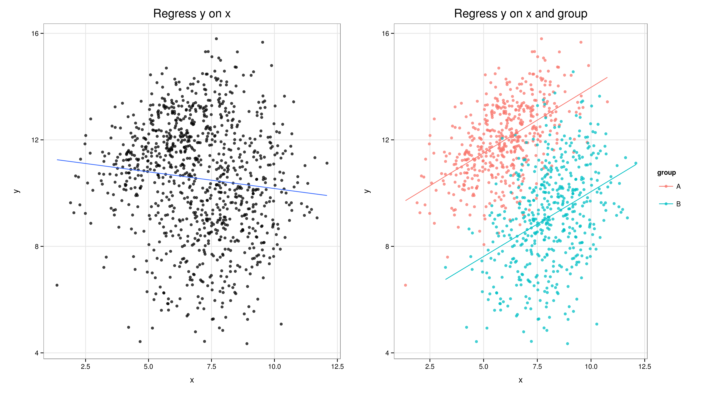
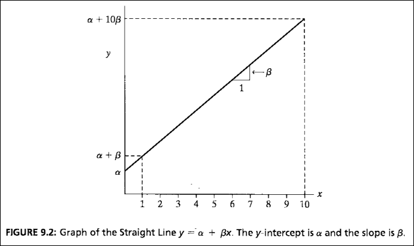
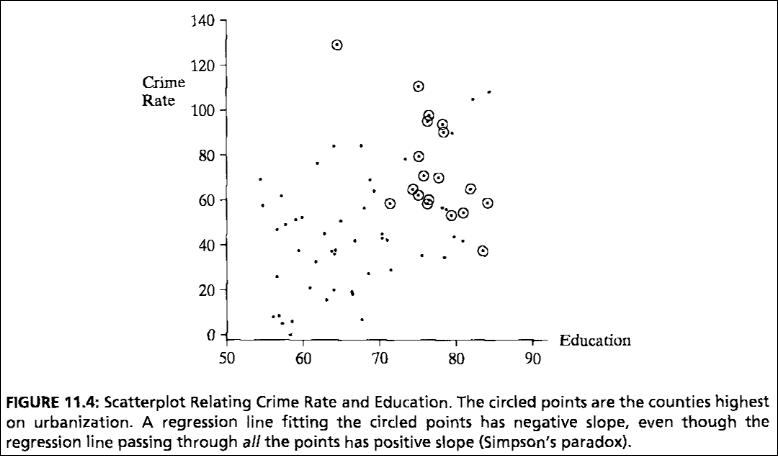

## Programa

1. Associação
2. Correlação
3. Impacto
3. Três condições para causalidade
4. Regressão

# Associação entre fenômenos

## Associação
Avaliar se dois fenômenos estão associados é uma da coisas mais interessantes que podemos responder com análise de dados. Geralmente, quando falamos em análise, temos em mente implícita ou explicitamente a ideia de associação entre dois ou mais fenêomenos.

Então, o que significa dizer que duas variáveis estão associadas?

## Associação como relação
Pense em algumas das perguntas mais interessantes em ciências sociais:

- Bairros mais policiados têm menor taxa de criminalidade?
- Candidatos que investem mais em campanha se elegem com mais frequência?
- Quando a economia cresce, melhora a avaliação do presidente?
- Países que produzem mais riqueza têm menor taxa de mortalidade infantil?
- Quando um país reduz barreiras comerciais, aumenta sua taxa de crescimento?

O primeiro passo para respondermos essas perguntas é definir se esses fenômenos estão associados. Como veremos mais adiante, porém, não podemos parar por aí.

## Uma medida de associação
Definimos que duas variáveis estão associadas quando, ao mudar o valor de uma delas, encontramos variação também na segunda. Podemos, então, pensar na associação como <span class="red">covariância</span>.

Em estatística, covariância é uma medida de **variação comum** entre duas variáveis. Se os valores de uma variável sobem enquanto outra fica parada, não podemos dizer que elas estão associadas. Não conseguimos aprender muita coisa sobre um fenômeno em que não há variação. 

<center>
**Variação é informação!**
</center>

# Correlação

## A importância da variância
Uma das medidas mais conhecidas da associação entre duas variáveis é o **coeficiente de correlação**, do qual vocês provavelmente já ouviram falar. Ele também é conhecido como **coeficiente r** ou **r de Pearson**.

Vamos ver a fórmula para o coeficiente de correlação logo mais, mas desde já é possível ressaltar a importância da variância para qualquer análise estatística: para calcular o coeficiente de correlação, precisamos calcular a covariância entre duas variáveis; para calcular a covariância, precisamos encontrar a variância

## Relembrando a variância
Essa é a fórmula para o cálculo de uma variância:

$$
\sigma^{2} = \sum_{i=1}^{n}\frac{(x_{i} - \bar{x})^{2}}{N}
$$

Estamos usando a notação populacional, mas o mesmo raciocínio serve para amostras (lembra qual é a diferença?). Essa mesma fórmula também pode ser representada da seguinte forma:

$$
\sigma^{2} = \sum_{i=1}^{n}\frac{(x_{i} - \bar{x}) * (x_{i} - \bar{x})}{N}
$$

## Da variância para a covariância
Para chegarmos à covariância, basta incluir na fórmula a segunda variável de interesse!

$$
cov(x, y) = \sum_{i=1}^{n}\frac{(x_{i} - \bar{x}) * (y_{i} - \bar{y})}{N}
$$

## Da covariância para a correlação
O índice de covariância que calculamos tem um problema: não está padronizado. Assim, não podemos comparar covariâncias entre variáveis com medidas muito desiguais.

Para normalizarmos a covariância, utilizamos o coeficiente *r de Pearson*. Basta dividir a covariância pelo desvio-padrão das duas variáveis.

$$
r = \sum_{i=1}^{n} \frac{cov(x,y)}{\sigma_{x}\sigma_{y}}
$$

## Coeficiente de correlação
O *r* é um coeficiente de correlação *linear*. Existem várias outras medidas, mas por enquanto ficaremos com essa, que é a mais utilizada. Como é uma medida pasronizada, seus valores variam de -1 a +1, e sua interpretação dependerá do valor numérico e do sinal:

- $r = 1 \longrightarrow$ correlação positiva perfeita
- $0 < r < 1 \longrightarrow$ correlação positiva
- $r = 0 \longrightarrow$ não há correlação (variáveis são independentes)
- $-1 < r < 0 \longrightarrow$ correlação negativa
- $r = -1 \longrightarrow$ correlação negativa perfeita

## Lembrete: quase nunca as relações são lineares

```{r message=FALSE, warning=FALSE, fig.align='center', fig.height=4}
library(tidyverse)
library(gapminder)

gapminder %>% filter(year == 2007) %>%
  ggplot() + theme_classic() +
  geom_point(aes(x = gdpPercap, y = lifeExp, color = continent, size = pop))
```

# Correlação e Causalidade

## Correlação e Causalidade
Ao detectar uma associação entre variáveis, precisamos tomar cuidado com as [correlações espúrias](http://www.tylervigen.com/spurious-correlations).

<center>

</center>

## Correlação e Causalidade

Quando encontramos associação entre duas variáveis, não conseguimos distinguir se:

- X influencia Y
- Y influencia X
- X e Y se influenciam mutuamente
- Z influencia X e Y (variável omitida)


## 3 condições para a causalidade
Para concluir que

$$X \longrightarrow Y$$

precisamos estabelecer três condições:

- Ordem temporal: $Y$ não pode acontecer antes de $X$. É a condição de mais fácil verificação.
- Associação: $X$ e $Y$ devem variar mutuamente. Avaliada com as ferramentas que vimos até agora no curso.
- <span class="red">Eliminação de alternativas</span>: outras explicações plausíveis para $Y$ são descartadas. É a condição mais difícil de verificar.

## Como eliminar explicações alternativas?
- Desenhos experimentais permitem o controle do processo de geração dos dados, por isso são considerados o padrão de ouro de estudos causais. O modelo mais usado nas ciências sociais é o de *potential outcomes*, desenvolvido por Donald Rubin.
- Quando não podemos fazer um experimento, buscamos eliminar explicações alternativas por meio de <span class="red">variáveis de controle</span>. A regressão multivariada abre espaço para incluirmos esses controles no modelo.
- A ideia é observar o efeito de $X$ sobre $Y$ quando a influência de explicações alternativas é eliminada.

## O que acontece quando adicionamos um controle?
<center>

</center>

## O que acontece quando adicionamos um controle?
<center>

</center>


# Regressão
## Regressão linear
Partindo de um gráfico de dispersão, o primeiro passo da regressão é <span class="red">ajustar uma reta</span> que passe o mais próximo possível de todos os pontos. A função que gera essa reta tem o nome de *equação de regressão*.

A partir dessa reta, podemos fazer previsões para $y$ a partir de valores específicos de $x$.

[Simulação](https://seeing-theory.brown.edu/regression-analysis/index.html#section1)


## Equação de regressão
Você provavelmente aprendeu no colégio a equação da reta com o seguinte formato:

$$y = ax + b$$

A reta de regessão segue o mesmo formato, mas com uma notação um pouco diferente:

$$y = \beta{_0} + \beta{_1} x{_1} + \ldots + \beta{_k} x{_k} + \epsilon$$

Em que:

$$\hat{\beta} = \frac{\sum_{i=1}^{n}(x_{i} - \bar{x})(y_{i} - \bar{y})}{\sum_{i=1}^{n}(x_{i} - \bar{x})^{2}}$$


## Exemplo para regressão bivariada
<center>

</center>

## Um exemplo prático

<center>

</center>

## Interpretação

- O gráfico mostra que os distritos com maior taxa de educação são aqueles com maior criminalidade.
- Os pontos com um círculo são aqueles com maior taxa de urbanização.
- Se traçarmos uma reta sobre *todos* os pontos, ela terá inclinação positiva
- Porém, se a reta for traçada somente entre os pontos com maior urbanização, a inclinação será negativa
- Portanto, quando controlamos por urbanização, o efeito da educação nas taxas de criminalidade é negativo.
- A imagem ilustra também o paradoxo de Simpson (que tecnicamente não é um paradoxo, nem foi descoberto por Simpson).

## Como fica a equação?
Lembrando que o formato geral de uma regressão múltipla é:

$$y = \beta{_0} + \beta{_1} x{_1} + \ldots + \beta{_k} x{_k} + \epsilon$$

Aplicando no exemplo acima, ficaria:

$$crime = \alpha + \beta_{1}*educ + \beta_{2}*urban + \epsilon $$


# Eleições 2018

## Quais são os determinantes do voto nas eleições brasileiras?

Vamos usar o banco de dados do TSE disponível no [pacote do CEPESP](https://github.com/Cepesp-Fgv/cepesp-r) para identificar as variáveis mais relevantes para a eleição de deputados federais. Este é apenas um exercício ilustrativo, sem a pretensão de ser 100% rigoroso. Um estudo mais detalhado precisaria levar em consideração outras variáveis não disponíveis no TSE (e vamos fazer isso nos próximos encontros).


```{r message=FALSE, warning=FALSE}
if (!require("devtools")) install.packages("devtools")
if (!require("cepespR")) devtools::install_github("Cepesp-Fgv/cepesp-r")

candidatos <- get_elections(year = 2018, position = "Deputado Federal", regional_aggregation = "Estado", political_aggregation = "Candidato")
candidatos <- candidatos %>% 
    group_by(UF) %>% 
    mutate(VOTOS_VALIDOS = sum(QTDE_VOTOS)) %>% 
    ungroup() %>% 
    mutate(VOTOS_PERC = QTDE_VOTOS/VOTOS_VALIDOS*100) %>% 
    ungroup()
```


## Modelo linear

```{r message=FALSE, warning=FALSE, results='hide'}
if (!require("moderndive")) install.packages("moderndive")
if (!require("knitr")) install.packages("knitr")

modelo_basico <- lm(VOTOS_PERC ~ IDADE_DATA_ELEICAO + relevel(factor(DESCRICAO_SEXO), ref = "MASCULINO") + relevel(factor(DESCRICAO_COR_RACA), ref = "BRANCA"), data = candidatos)

summary(modelo_basico)
```


